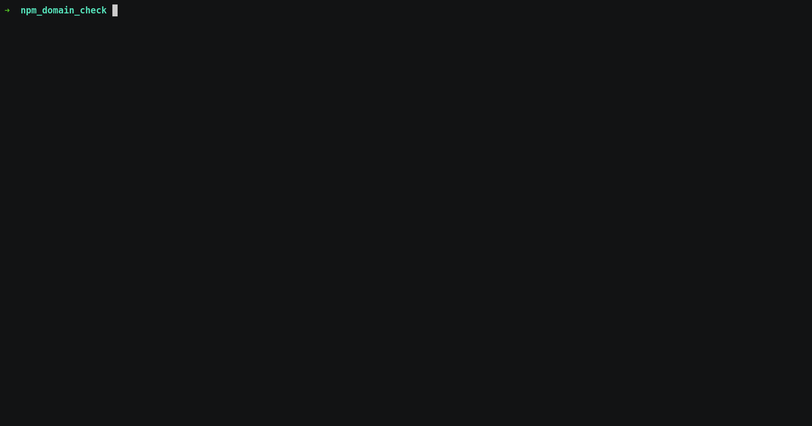

# npm_domain_check

This tool checks if a specific npm package may be susceptible to domain hijacking (directly or via dependencies) 

More information is available in [our blogpost](https://jfrog.com/blog/npm-package-hijacking-through-domain-takeover-how-bad-is-this-new-attack/)

## Usage

Install the required pip dependencies - 

`$ pip install -r requirements.txt`

And then run the tool like so - 

`python npm_domain_check.py /path/to/package.json [--no-indirect-dependencies] [--no-resolve-first]`

The tool will check if the npm module could be vulnerable to domain hijacking.

### Args

* `/path/to/package.json` - path to the `package.json` file of the package to be checked
* `--no-indirect-dependencies` - by default, the tool checks all direct & indirect dependencies of the module. If this flag is specified, the tool will check only the direct dependencies.
* `--no-resolve-first` - by default, for speeding up the scan, a WHOIS domain check will only be done on domains that resolve to a proper IP address. If this flag is specified, the tool will skip the resolution check and run a WHOIS domain check on all candidates. This can be more accurate in some cases, but is slower.

### Example

## Note on findings

Because different domain registrars may provide a different output for *whois*, the warning does not present a 100% guarantee that the issue exists. We recommend manually verifying domain availability per each warning before taking any action.
